<!-- Created by:Prince kumar
GitHub:Prince-GH -->
[](https://github.com/Prince-GH)

[](https://t.me/+PzMgzITg_9EyNzM9)<br>
## Table of Content 
<details>
<summary>HTML</summary>

- [Introduction](#introduction)
- [Elements](#html-elements)
- [Color Code](#color-code)
- [Shortcut](#shortcut)
</details>

---
<br>

## Introduction

**HTML** is the markup language that helps to provide a stracture to a website. **HTML Termonologys.** are:

- Tag
- Elements
- Atributes
```html
eg : <p style="color:red";> Paragraph </p>
```
- Tag is `<p></p>`
- Atribute is `style="color:red";`
- Element is `<p style="color:red";> Paragraph </p>`

### HTML Elements
---
<details>
<summary>Elements</summary>

- [Meta tag](#meta-tag)
- [Heading tag](#heading)
- [Paragraph](#paragraph)
- [Break tag](#break-line-tag)
- [Pre tag](#pre-tag)
- [Comment](#comment)
- [Bold & Strong](#bold--strong)
- [i & em](#i--em)
- [Small](#small)
- [Sub & Sup](#sub--sup)
- [del, ins & mark](#del-ins--mark-tag)
- [Blockqute](#blockquote-q-cite--cite)
- [q](#blockquote-q-cite--cite)
- [cite](#blockquote-q-cite--cite)
- [`<cite>`](#blockquote-q-cite--cite)
- [aabr](#aabr)
- [bdo](#bdo)
- [color](#color)
- [address](#address)
- [anchor](#anchor)
- [img](#img)
- [picture](#picture)
- [map](#map)
- [table](#table)
- [List](#list)
- [Element Display](#elements-display)
- [Id & Class](#id-and-class)
- [iframe](#iframe)
- [base](#base)
- [Font](#special-font)
- [Segmantics](#semantics)
- [Forms](#forms)
- [Input](#input)
- [Video](#Video)
- [Audio](#video)
- [HTML API](#html-api)
</details>

---
### Meta tag
```html
<!DOCTYPE html>
<html lang="en">
<head>
    <meta charset="UTF-8">
    <meta name="description" content="A description of the page">
    <meta name="google" content="nopagereadaloud">
    <meta name="google" content="nositelinkssearchbox">
    <meta name="viewport" content="width=device-width, initial-scale=1.0">
    <title>HTML</title>
</head>
<body>

</body>
</html>
```

- `<!DOCTYPE html>`
    - This tag spacify the browser which type of document is serving.

- `<html lang="en">`
    - This tag specify the document language in this case it's an english.
- `<head>`
    - This tag hold the importent information about the webpage that helps the website to serve well.
    - `<meta ..>`
      - `<meta charset="UTF-16">` This defines the page's content type and character set.
      - `<meta name="..." content="..." >`
        - |name|content|use|define|
          |---|---|---|---|
          | description | A description of the page | `<meta name="description" content="A description of the page">`| Use this tag to provide a short description of the page. In some situations, this description is used in the snippet shown in search results.|
          |google|nositelinkssearchbox|`<meta name="google" content="nositelinkssearchbox">`|When users search for your site, Google Search results sometimes display a search box specific to your site, along with other direct links to your site. This tag tells Google not to show the sitelinks search box.|
          |google|nopagereadaloud|`<meta name="google" content="nopagereadaloud">`|Prevents various Google text-to-speech services from reading aloud web pages using text-to-speech (TTS).|
          |viewport|width=device-width, initial-scale=1.0|`<meta name="viewport" content="width=device-width, initial-scale=1.0">`|This gives the browser instructions on how to control the page's dimensions and scaling. The `width=device-width` part sets the width of the page to follow the screen-width of the device (which will vary depending on the device). The `initial-scale=1.0` part sets the initial zoom level when the page is first loaded by the browser.|
          
### Heading 
---
**HTML** has six sizes of heading tag.
```html
<h1>,<h2>,<h3>,<h4>,<h5> and <h6>
    
<!DOCTYPE html>
<html lang="en">
<head>
    <meta charset="UTF-8">
    <meta name="viewport" content="width=device-width, initial-scale=1.0">
    <title>Heading</title>
</head>
<body>
    <h1>Heading 1</h1>
    <h2>Heading 2</h2>
    <h3>Heading 3</h3>
    <h4>Heading 4</h4>
    <h5>Heading 5</h5>
    <h6>Heading 6</h6>
</body>
</html>
``` 
output:<br>


><br>💡<br> 
Default sizes for headings:<br>
Heading level 1: 24 pixels<br>
Heading level 2: 20 pixels<br>
Heading level 3: 16 pixels<br>
Heading level 4: 14 pixels<br>
Heading level 5: 12 pixels<br>
Heading level 6: 10 pixels<br><br>

### Paragraph
---
**HTML** has a specific tag to write paragraph `<p>...</p>`
```html
<!DOCTYPE html>
<html lang="en">
<head>
    <meta charset="UTF-8">
    <meta name="viewport" content="width=device-width, initial-scale=1.0">
    <title>Paragraph</title>
</head>
<body>
    <h1>Paragraph</h1>
    <p>Lorem ipsum dolor sit amet consectetur adipisicing elit. Velit tempora adipisci omnis. Dolore molestias et incidunt doloremque quam hic explicabo, quibusdam autem optio nisi! Eveniet, nam sint. Reiciendis, suscipit optio!</p>
    <p>Lorem ipsum dolor sit amet consectetur adipisicing elit. Velit tempora adipisci omnis. Dolore molestias et incidunt doloremque quam hic explicabo, quibusdam autem optio nisi! Eveniet, nam sint. Reiciendis, suscipit optio!</p>
</body>
</html>
```
Output:<br>

><br>💡<br>
To write demo paragraph use `<p>Lorem ipsum `Tab`</p>`.
<br><br>

### Break tag
---
**HTML** has a special break line tag `<br>`.
```html
<!DOCTYPE html>
<html lang="en">
<head>
    <meta charset="UTF-8">
    <meta name="viewport" content="width=device-width, initial-scale=1.0">
    <title>Paragraph</title>
</head>
<body>
    <h1>Paragraph Without br tag </h1>
    <p>Lorem ipsum dolor sit amet consectetur adipisicing elit. Velit tempora adipisci omnis. Dolore molestias et incidunt doloremque quam hic explicabo, quibusdam autem optio nisi! Eveniet, nam sint. Reiciendis, suscipit optio!
    </p>
    <h1>Paragraph With br tag</h1>
    <p>Lorem ipsum dolor sit amet <br> consectetur adipisicing elit. Velit tempora <br> adipisci omnis. Dolore molestias et incidunt doloremque quam hic explicabo, quibusdam<br> autem optio nisi! Eveniet, nam sint. Reiciendis, suscipit optio!
    </p>
</body>
</html>
```
Output:<br>


### Pre tag
---
**HTML** has a special tag that helps to print a *ASII* pattern is `<pre> </pre>`.
```html
<!DOCTYPE html>
<html lang="en">
<head>
    <meta charset="UTF-8">
    <meta name="viewport" content="width=device-width, initial-scale=1.0">
    <title>Paragraph</title>
</head>
<body>
    <h2>Without pre tag </h2>
    <p>
        
  _____     ____    _______ 
  |  __ \   / __ \  |__   __|
  | |  | | | |  | |    | |   
  | |  | | | |  | |    | |   
  | |__| | | |__| |    | |   
  |_____/   \____/     |_|   
                             
                             
     
    </p>
    <h2>With pre tag</h2>
    <pre>
        
  _____     ____    _______ 
  |  __ \   / __ \  |__   __|
  | |  | | | |  | |    | |   
  | |  | | | |  | |    | |   
  | |__| | | |__| |    | |   
  |_____/   \____/     |_|   
                             
                             
 
    </pre>
</body>
</html>
```
Output:<br>


### Comment
---
  The Commented area is not visually shown. It is used to understand code for next developer. it is used if the text is writen between `<--`and`-->`.
  ```html
  <!DOCTYPE html>
  <html lang="en">
  <head>
      <meta charset="UTF-8">
      <meta name="viewport" content="width=device-width, initial-scale=1.0">
      <title>Comment</title>
  </head>
  <body>
      <h1>Comment is not used</h1>
      <!-- <p>Comment is used</p> -->
  </body>
  </html>
  
  ```
  Output:<br>
  
  ><br>💡<br>
  Comments are available to be read in the source view.<br>
  Sortcut key to use comment in or comment out is `CTRL+/`.
  <br><br>
  
### Bold & Strong
---
  To make a text bold, use the `<b>` tag. There is another tag, `<strong>`, that works the same as `<b>`, but the `<strong>` tag is more important for search engines. If the keyword of a search matches the text in the `<strong>` tag, the search engine will give the page more priority.
  
  ```html
   <!DOCTYPE html>
   <html lang="en">
   <head>
       <meta charset="UTF-8">
       <meta name="viewport" content="width=device-width, initial-scale=1.0">
       <title>Bold and strong</title>
   </head>
   <body>
      <p>
       Lorem ipsum, dolor sit amet <b>consectetur</b> adipisicing elit. <br>Vero debitis alias maiores, quasi <strong>inventore</strong>, tenetur quos,  corrupti beatae corporis quibusdam voluptate!<br> Incidunt commodi a nisi repudiandae eos, consequuntur laboriosam.
      </p>
   </body>
   </html>
  ```
  
   Output:<br>
   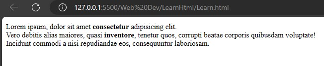

### i & em
---
  To make a text italic, use the `<i>` tag. There is another tag, `<em>`, that works the same as `<i>`, but the `<em>` tag is more important for search engines, `em` means empisize. If the keyword of a search matches the text in the `<em>` tag, the search engine will give the page more priority.
  ```html
  <!DOCTYPE html>
  <html lang="en">
  <head>
      <meta charset="UTF-8">
      <meta name="viewport" content="width=device-width, initial-scale=1.0">
      <title>i and em</title>
  </head>
  <body>
     <p>
      Lorem ipsum, dolor sit amet <i>consectetur</i> adipisicing elit. <em>Vero debitis alias</em> maiores,<br> quasi <em>inventore</em>, tenetur quos,  corrupti beatae corporis quibusdam voluptate!<i> Incidunt commodi a nisi repudiandae eos,<br> consequuntur laboriosam</i>.
     </p>
  </body>
  </html>
  ```
  Output:<br>
  

### Small
---
  The `<small>` tag is used to make text smaller compared to other text styles used in the sentence. It is used to reduce the importance of the text. It is often used for copyright information, legal disclaimers, and other side comments.
  ```html
  <!DOCTYPE html>
  <html lang="en">
  <head>
      <meta charset="UTF-8">
      <meta name="viewport" content="width=device-width, initial-scale=1.0">
      <title>i and em</title>
      <style>
          p{
              font-family: 'Lucida Sans', 'Lucida Sans Regular', 'Lucida Grande', 'Lucida Sans Unicode', Geneva, Verdana, sans-serif;
          }
      </style>
  </head>
  <body>
      <h3>Without small tag</h3>
      <p>Copyright &copy; 2023 Example Company. All rights reserved.</p>
  
      <h3>With samll tag</h3>
      <p><small>Copyright &copy; 2023 Example Company. All rights reserved.</small></p>
  
  </body>
  </html>
  ```
  Output:<br>
  
  
### Sub & Sup
  ---
  The **subscript** tag, `<sub>`, is used to write lower baseline text in a smaller size, such as chemical formulas and footnote numbers.<br> The **superscript** tag, `<sup>`, is used to write raised baseline text in a smaller size, such as numerical exponents.
  ```html
  <!DOCTYPE html>
  <html lang="en">
  <head>
      <meta charset="UTF-8">
      <meta name="viewport" content="width=device-width, initial-scale=1.0">
      <title>Sub and sup</title>
      <style>
          p{
              font-family: Verdana, Geneva, Tahoma, sans-serif;
          }
      </style>
  </head>
  <body>
      <h3>Chemical formula of Ethanol: </h3>
      <p>C<sub>2</sub>H<sub>6</sub>O</p>
      <h3>What is log<sub>2</sub>64: </h3>
      <p>2<sup>6</sup>=64. so log<sub>2</sub>64 is 6.</p>
  </body>
  </html>
  ```
  Output:<br>
  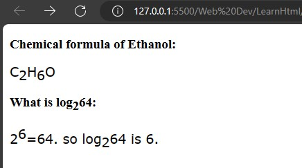
  
### del, ins & mark tag 
---
  The `<del>` tag is used to delete text, but shows it in ~~strick Though~~ to the reader and also to indicate that it has been deleted or to show a new update by highlighting by the use `<ins>` or `<mark>` tag.
  ```html
  <!DOCTYPE html>
  <html lang="en">
  <head>
      <meta charset="UTF-8">
      <meta name="viewport" content="width=device-width, initial-scale=1.0">
      <title>del ins and mark</title>
      <style>
          p{
              font-family: Verdana, Geneva, Tahoma, sans-serif;
          }
      </style>
  </head>
  <body>
      <p>
          In this paragraph, <del>this text has been deleted</del>, <mark>this text was updated recently</mark>, and <ins>it will be update again</ins>.
      </p>
  </body>
  </html>
  ```
  Output:<br>
  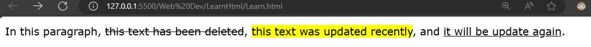

### Blockquote, q, cite & `<cite>`
---
`<blockquote>` is used to write a quote, but it does not give any styling like `<q>` does. In Google SEO, `<blockquote>` is given more priority compared to `<q>.` To make `<blockquote>` look good, we use `CSS`.<br>
To give a reference to a quote, use the `cite` attribute to provide a link or to give the name of the person who wrote the quote using the `<cite>` tag.
```html
<!DOCTYPE html>
<html lang="en">
<head>
    <meta charset="UTF-8">
    <meta name="viewport" content="width=device-width, initial-scale=1.0">
    <title>quote</title>
</head>
<body>
    <p style="background-color: yellowgreen;">Today's quote.</p>
    <blockquote cite="https://www.hs-aalen.de/de">
        Programming isn't about what you know; it's about what you can figure out.
    </blockquote>
    <q style="background-color: rgb(166, 193, 194);">
        Programming isn't about what you know; it's about what you can figure out.
    </q>
    <cite>- Grace Hopper</cite>
</body>
</html>
```
Output:<br>


### aabr
---
`<abbr>` tag is used to add `Abbreviation`. To define the `abbr` use `title` attributes.
```html
<!DOCTYPE html>
<html lang="en">
<head>
    <meta charset="UTF-8">
    <meta name="viewport" content="width=device-width, initial-scale=1.0">
    <title>Abbreviation</title>
</head>
<body>
<abbr title="Hyper text markup language">HTML</abbr>
</body>
</html>
```
Output:<br>
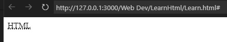
>Note: To see the abbreviation hover the mouse on the HTML part.

### bdo
---
`<dbo>` is Bidirectional Text Override element that helps to change the direction of the text from `dir` attribute `ltr` or `rtl`.
```html
<!DOCTYPE html>
<html lang="en">
<head>
    <meta charset="UTF-8">
    <meta name="viewport" content="width=device-width, initial-scale=1.0">
    <title>Direrectionl text</title>
</head>
<body>
Name:Prince <br>
Name:<bdo dir="req">Prince</bdo><br>
Name:<bdo dir="ltr">Prince</bdo><br>
Name:<bdo dir="rtl">Prince</bdo><br>
</body>
</html>
```
Output:<br>


### address
---
`<address>` tag is used to write the address. It will helps to improve the SEO for browser.
```html
<!DOCTYPE html>
<html lang="en">
<head>
    <meta charset="UTF-8">
    <meta name="viewport" content="width=device-width, initial-scale=1.0">
    <title>address</title>
</head>
<body>
<p style="border: 5px solid rgb(137, 106, 167);border-radius: 50px;font-size: 20pt; padding-left: 12px; color: white; background: rgb(69, 40, 97)">Today is no meeating!!</p>
<address style="border: 2px dotted blueviolet;">
    #147,<br>
    New town apartment <br>
    New york,USA
</address>
</body>
</html>
```
Output:<br>


### Color
---
Colors are represented in `HEX`, `RGB`, `RGBA`, `HSL` & `CMYK`.
- ### HEX
  `HEX` is a shorthand way of representing RGB colors. It uses a hexadecimal (base 16) number system to represent the red, green, and blue components of a clolor. `HEX` code are typiccally written as a six digit number, with each pair of components. For example, the hex code `#FFFFFF` represents pure white, while the hex code `#000000` represents pure black.
- ### RGB
  `RGB` is a color model that uses the additive primary colors red, green, and blue to represent all colors. Each primary color is represented by a value from `0` to `255`, with `0` being the darkest and 255 being the brightest. By combining the different intensities of the red, green, and blue primary colors, any color can be represented.
- ### RGBA
  `RGBA` is an extension of the RGB color model that adds a fourth channel for transparency. The alpha channel is represented by `A` value from `0` to `255`, with `0` being completely transparent and `255` being completely opaque. `RGBA` colors are often used in web design and graphics to create transparent backgrounds and semi-transparent objects.  
- ### HSL
  `HSL` (Hue, Saturation, and Lightness) is a color model that is based on the way that humans perceive color. It uses three values to represent a color: `hue`, `saturation`, and `lightness`. `Hue` is the fundamental color of the color, `saturation` is the intensity of the color, and `lightness` is the brightness of the color. Range of `hue` value is `0` to `360` as a colour 
- ### CMYK
  `CMYK` (`Cyan`, `Magenta`, `Yellow`, and `Black`) is a color model that is used in printing. It uses four inks to represent all colors: `cyan`, `magenta`, `yellow`, and `black`. By combining the different inks, any color can be represented.

```html
<!DOCTYPE html>
<html lang="en">
<head>
    <meta charset="UTF-8">
    <meta name="viewport" content="width=device-width, initial-scale=1.0">
    <title>del ins and mark</title>
    <style>
        p{
            font-family: Verdana, Geneva, Tahoma, sans-serif;
        }
    </style>
</head>
<body style="background-color: rgb(0, 0, 0);">
    <p style="color:rgb(255, 154, 0);">
        In this paragraph
    </p>
</body>
</html>
```
Output:<br>
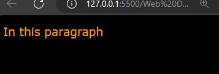

### anchor
---
`<a>` anchor tag is used to make a clickable like for website,tel,email etc.<br>Attributes of anchor tag are:
- download
  - In `download` attribute given file get downloaded in the system.
  ```html
    <!DOCTYPE html>
  <html lang="en">
  <head>
      <meta charset="UTF-8">
      <meta name="viewport" content="width=device-width, initial-scale=1.0">
      <title>Download</title>
  </head>
  <body>
      <p><a href="Images/Download.jpg" download="File Downloaded">Click here</a> to Download file.</p>
  </body>
  </html>
  ```
  Output:<br>
  
  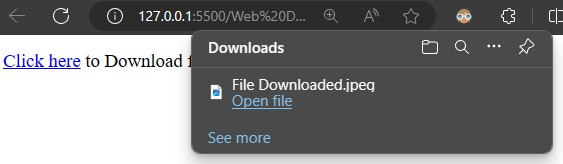
  
  <br>
- href
  - `href` used to provide hyperlink referance to the text that has provided. It could be a link of **absolute URL** ,**relative URL**, **Element on the same page** ,**telephone** ,**email-id** ,**sms**.
    - Absolute URL<br>
      URL's data are not saved to user server known as absolute url.
      ```html
      <!DOCTYPE html>
      <html lang="en">
      <head>
          <meta charset="UTF-8">
          <meta name="viewport" content="width=device-width, initial-scale=1.0">
          <title>Absolute URL</title>
      </head>
      <body>
          <a href="https://google.com">
              <p style="border:none;background:linear-gradient(60deg,#569656,#096109);border-radius: 5px;height: 50px;width: 100px;">              
              </p>
          </a>
      </body>
      </html>
      ```
      Output<br>
      
      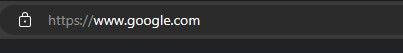
    - Relaive URL<br>
      URL's data are saved to user servet known as relative url.  
        ```html 
        <!DOCTYPE html>
        <html lang="en">
        <head>
            <meta charset="UTF-8">
            <meta name="viewport" content="width=device-width, initial-scale=1.0">
            <title>Relative URL</title>
        </head>
        <body>
            <a href="./Images">
                <p style="border:none;background:linear-gradient(60deg,#569656,#096109);border-radius: 5px;height: 50px;width: 100px;color: white;">
              
                </p>
            </a>
        </body>
        </html>
              </body>
              </html>
        ```
        Output:<br>
      
      
    - Element on the same page<br>
      To link an element on the same page, you need to add an `id` attribute to the element and then use `href="#id_name"` in the `<a>` tag. 
      ```html
      <!DOCTYPE html>
      <html lang="en">
      <head>
          <meta charset="UTF-8">
          <meta name="viewport" content="width=device-width, initial-scale=1.0">
          <title>Relative URL</title>
      </head>
      <body>
       <h2>Table of Content</h2>
       <a href="#Topic1"><h3>Topic 1</h3></a>
       <a href="#Topic2"><h3>Topic 2</h3></a>
       <a href="#Topic3"><h3>Topic 3</h3></a>
       <hr>
       <h2 id="Topic1">Topic 1</h2>
      <p>Text here</p>
       <h2 id="Topic2">Topic 2</h2>
       <p>Text here</p>
       <h2 id="Topic3">Topic 3</h2>
       <p>Text here</p>
      </body>
      </html>
      ```
      Output:<br>
      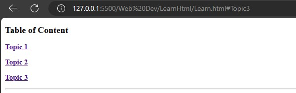
      
    - tel, mailto, sms<br>
      To diractly open call,mail box and sms box use `tel`, `mailto` and `sms`. In `herf="tel:+91.89.969.1238"`.
       ```html
       <!DOCTYPE html>
       <html lang="en">
       <head>
           <meta charset="UTF-8">
           <meta name="viewport" content="width=device-width, initial-scale=1.0">
           <title>Contact Us</title>
       </head>
       <body>
       <h3>Mail Us:</h3><a href="mailto:pq6211@gmail.com">pq6211@gmil.com</a>
       <h3>Contact Us:</h3><a href="tel:+918695901836">+91 869501836</a>
       <h3>Massage Us:</h3><a href="sms:"><a href="sms:+918695901836?body=Hello from HTML!">SMS Us</a>
       
       </body>
       </html>
       ```
       Output<br>
       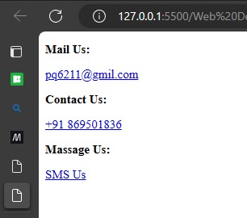

    - hreflang & lang<br>
      The `hreflang` and `lang` attributes both serve to specify the language of the page. They help to improve the page's reach, enhance its SEO, and boost traffic to the page.
      |language|lang code|
      |---|---|
      |English|en|
      |Frence|fr|
      |Spanish|es|
      |German|de|
      |Italian|it|
      |Japanese|ja|
      |Chinese|zh-cn/zh-tw|
      |Russian|ru|
      |Korean|ko|
      |Portuguese(Brazil)|pt-br|
      ```html
      <!DOCTYPE html>
       <html lang="fr">
       <head>
           <meta charset="UTF-8">
           <meta name="viewport" content="width=device-width, initial-scale=1.0">
           <title>Lang</title>
       </head>
       <body>
        <h5>Bonjour, comment allez-vous? </h5>
       </body>
       </html>
      ```
      Output:<br>
            
      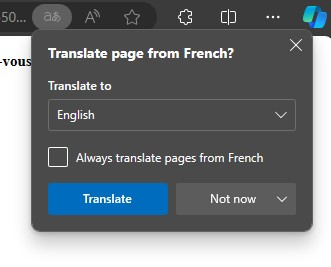
      
    - Target<br>
    The `target` attribute in HTML is used to specify where to open the linked document.
      - `_blank`: Opens the linked document in a new window or tab.
      - `_self`: Opens the linked document in the same window or tab.
        ```html
        <!DOCTYPE html>
        <html lang="en">
        <head>
            <meta charset="UTF-8">
            <meta name="viewport" content="width=device-width, initial-scale=1.0">
            <title>Target</title>
        </head>
        <body>
            <a href="https://google.com" target="_blank"><h3>_blank Open in new tab</h3></a>
            <a href="https://google.com" target="_self"><h3>_self Open in same tab</h3></a>
        </body>
        </html>
        ```
        Output:<br>
            
        
        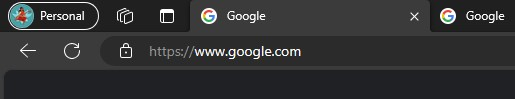

        


### img
---
`` tag helps to use images in website.<br>
The `src=" "` attribute stand for source of the image. <br>
The `alt=" "` attribute provides alternative text for images. This text is displayed to screen readers when the image cannot be loaded due to network issues or other reasons. It helps users to understand the webpage content even if they cannot see the image itself, making the webpage more accessible.<br>
The `width=" "` attribute helps to set the width of the images.<br>
```html
<!DOCTYPE html>
<html lang="en">
<head>
    <meta charset="UTF-8">
    <meta name="viewport" content="width=device-width, initial-scale=1.0">
    <title>Image Tag</title>
</head>
<body>
    <h3>NOTEBOOK 1</h3>
    
    <h3>NOTEBOOK 2</h3>
    
    <h3>NOTEBOOK 3</h3>
    
</body>
</html>
```
Output<br>


### Picture
---
The `<picture>` tag is similar to the `` tag, but it acts as a container for different image sources based on **media queries**. Each `<source/>` tag is a self-closing element that specifies attributes like `media` *(for defining the display conditions)* and `srcset` *(which defines a set of alternative image sources based on factors like resolution or device pixel density)*.
- **min-width:** When the *viewport width* is **less** than the specified **min-width** value, only display the image defined in the corresponding `<source>` element.<br>
<br>
- **max-width:** When the *viewport width* is **greater** than the specified **max-width** value, only display the image defined in the corresponding `<source>` element.<br>
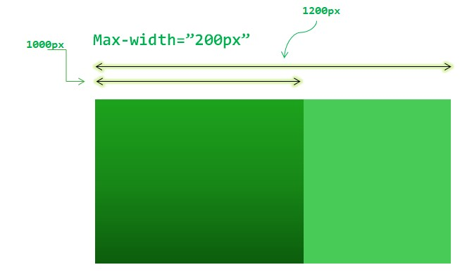<br>


```html
<!DOCTYPE html>
<html lang="en">
<head>
    <meta charset="UTF-8">
    <meta name="viewport" content="width=device-width, initial-scale=1.0">
    <title>Picture Tag</title>
</head>
<body>
    <picture>
        <source media="(min-width:600px)" srcset="Image/imgesTag.jpg"  />
        <source media="(max-width:800px)" srcset="Image/imgesTag.jpg"  />
        
    </picture>
</body>
</html>
```
### map
---
`<map>` tag is used to add the action on the image's particular area. To generate the image map on the image, follow this **[website]( https://www.image-map.net/.)**.


```html
<!DOCTYPE html>
<html lang="en">
<head>
    <meta charset="UTF-8">
    <meta name="viewport" content="width=device-width, initial-scale=1.0">
    <title>map tag</title>
</head>
<body>
    

<map name="image-map">
    <area target="_blank" alt="Google" title="Google" href="https://www.google.com/" coords="46,45,22" shape="circle">
    <area target="_blank" alt="gitHub" title="gitHub" href="https://github.com/" coords="116,46,25" shape="circle">
</map>

</body>
</html>
```
### table
---
The `<table>` tag is used to build rows and columns on the website to represent data in tabular form. It consists of multiple tags to create a stunning table, like:

`<th>`: Defines the heading of a column.<br>
`<tr>`: Creates the rows of the table.<br>
`<td>`: Provides data to a cell in the row.<br>
> 💡 <br> To make your table even more attractive, use `CSS` attributes.<br>  Use **shortcut** to create table fast `table>tr>th*3`. It will create a row for heading.`table>tr>td*3`. It will create a row for data. `*3` is used to create a **cell**.

```html
<!DOCTYPE html>
<html lang="en">
<head>
    <meta charset="UTF-8">
    <meta name="viewport" content="width=device-width, initial-scale=1.0">
    <title>Table</title>
    <style>
        table{
            width: 250px;
            border-collapse: collapse;
        }
        td,tr{
            border: 1px solid black;
            padding:12px;
        }
        tr:nth-child(even){
            background-color: lightblue;
        }
    </style>
</head>
<body>
       <table>
             <tr>
                <th>ID</th>
                <th>Name</th>
                <th>E-mail</th>
             </tr>

                <tr>
                    <td>102</td>
                    <td>Prince</td>
                    <td>Prince@git.in</td>
                </tr>

                <tr>
                    <td>103</td>
                    <td>Xdean</td>
                    <td>Xdean@git.in</td>
                </tr>
    
                <tr>
                    <td>102</td>
                    <td>Prince</td>
                    <td>Prince@git.in</td>
                </tr>
       </table>
</body>
</html>
```
Output:<br>


<br>

`colspan` attribute can be used to merge columns together.

```html
<table>
             <tr>
                 <th colspan="2">ID/NAME</th>
                <th>E-mail</th>
             </tr>
```
output:<br>


### List
---
In `HTML` lists, there are two types: `unordered` and `ordered` lists. Before we dive into the types of lists, let's first discuss *what a list is*. A list is a collection of related nouns arranged in a specific sequence under a main heading.
- Unordered List<br>
The `<ul>` tag contains `<li>` tags that hold list items.

- Ordered List<br>
The `<ol>` tag contains `<li>` tags that hold list items in a specific order.
> 💡 Use shortcut `ul>li*5` or `ol>li*5` to autotype the **html** code.
```html
<!DOCTYPE html>
<html lang="en">
<head>
    <meta charset="UTF-8">
    <meta name="viewport" content="width=device-width, initial-scale=1.0">
    <title>List</title>
</head>
<body>
    <p>Data stracture</p>
    <ol>
        <li>
            <p>Liner</p>
            <ul>
                <li>Array</li>
                <li>Linked List</li>
                <li>Stack</li>
                <li>Queue</li>
            </ul>
        </li>
        <li>
            <p>Non-Linear</p>
            <ul>
                <li>Tree</li>
                <li>Graph</li>
            </ul>
        </li>
    </ol>
</body>
</html>
```
Output:<br>


### Element's Display 
---


Elements are mainly displayed in two types: `inline` and `block`. **Inline** elements take up space on the webpage according to their *actual size*, while **block** elements occupy the *full width* available on the line and start on new lines.
>💡 To check the element is inline or block <br>
◻ Open webpage.<br> 
◻ `CTRL+SHIFT+I`<br>
◻ Drag to elements.

```html
<!DOCTYPE html>
<html lang="en">
<head>
    <meta charset="UTF-8">
    <meta name="viewport" content="width=device-width, initial-scale=1.0">
    <title>Element display</title>
</head>
<body>
    <span>Inline</span>
    <p>Block</p>
</body>
</html>
```
Output:<br>


### id and class
---
**id** and **class** are used to apply a set of styles to **HTML elements**. Let's see how it works! **W**rite the CSS styles in the `<style>` tag or in a separate **CSS document**. For writing a **class style**, use a **dot** prefix (e.g., `.front_box`). For **ID styling**, use a **hash** prefix (e.g., `#front_box`). To apply these styles, use `class="front_box"` or `id="front_box"` as attributes on the **HTML element**.
> 💡 To target a *specific element* on the entire webpage, you can directly use its element name in some contexts (e.g., `p{..}` `h3{..}`). However, in most cases, you'll need to use prefixes like` . `for **classes** or `#` for **IDs to achieve precise targeting**.<br>💡 To target multiple HTML elements simultaneously, you can use a comma (",") to separate them. (e.g., p,h3{..})<br>💡 Both IDs and class names are case-sensitive.

 ```html
 <!DOCTYPE html>
<html lang="en">
<head>
    <meta charset="UTF-8">
    <meta name="viewport" content="width=device-width, initial-scale=1.0">
    <title>Id and class</title>
    <style>
        p,h2{
            font-size: 15px;
            color: green;
        }
        ol{
            border: 2px dashed  rgba(34, 134, 96, 0.63);
            
        }
        .Linear{
            font-family: 'Lucida Sans', 'Lucida Sans Regular', 'Lucida Grande', 'Lucida Sans Unicode', Geneva, Verdana, sans-serif;
            list-style-type: square;
        }
        .Non-Linear{
            list-style-type:disc;
        }
        #done{
            font-size: 20px;
            color: brown;
            text-decoration: line-through;
        }

    </style>
</head>
<body>
    <!DOCTYPE html>
    <html lang="en">
    <head>
        <meta charset="UTF-8">
        <meta name="viewport" content="width=device-width, initial-scale=1.0">
        <title>List</title>
    </head>
    <body>
        <h2>Data stracture</h2>
        <ol>
            <li>
                <p>Linear</p>
                <ul class="Linear">
                    <li>Array</li>
                    <li id="done">Linked List</li>
                    <li>Stack</li>
                    <li>Queue</li>
                </ul>
            </li>
            <li>
                <p>Non-Linear</p>
                <ul class="Non-Linear">
                    <li>Tree</li>
                    <li id="done">Graph</li>
                </ul>
            </li>
        </ol>
    </body>
    </html>
</body>
</html>
 ```
Output:<br>


### iframe
---
`<iframe>` is used to embed the content of another webpage in a specific area of the current page.
```html
<!DOCTYPE html>
<html lang="en">
<head>
    <meta charset="UTF-8">
    <meta name="viewport" content="width=device-width, initial-scale=1.0">
    <title>Ifrmae</title>
    <style>
        .frame{
            height:400px;
            width: 100%;
            border: 2px solid black;   
        }
    </style>
</head>
<body>
<iframe src="/Web Dev/LearnHtml/README.md" class="frame" ></iframe>

<iframe width="560" height="315" src="https://www.youtube.com/embed/TpOYiEwBErk?si=telsXxuaBHL7m0j7" title="YouTube video player" frameborder="0" allow="accelerometer; autoplay; clipboard-write; encrypted-media; gyroscope; picture-in-picture; web-share" allowfullscreen></iframe>

</body>
</html>
```
Output:<br>


### base
---
`<base>` is used to create a referance link of images, video and other attributes.
```html
<!DOCTYPE html>
<html lang="en">
<head>
    <meta charset="UTF-8">
    <meta name="viewport" content="width=device-width, initial-scale=1.0">
    <title>base tag</title>
      <base href="./Images/" target="_blank">
</head>
<body>
    
</body>
</html>
```
Output:<br>


### Special font 
---
`<code>`,`<kbd>`,`<samp>`,`<var>`,`<pre>`
```html
<!DOCTYPE html>
<html lang="en">
<head>
    <meta charset="UTF-8">
    <meta name="viewport" content="width=device-width, initial-scale=1.0">
    <title>Special font</title>
    <style>
        body{
            font-size: large;
            font-weight: bold;
        }
    </style>
</head>
<body>
 <code>code:The souls we've lost may be gone, but they are never forgotten.</code><br>
 <kbd>kbd:The souls we've lost may be gone, but they are never forgotten.</kbd><br>
 <samp>samp:The souls we've lost may be gone, but they are never forgotten.</samp><br>
 <var>var:The souls we've lost may be gone, but they are never forgotten.</var><br>
 <pre>pre:The souls we've lost may be gone, but they are never forgotten.</pre><br>
</body>
</html>
```
Output:<br>


### Semantics
---
Semantcs are the block of code that work specific task. Genrally it is written in `<div>` tag but now a days to make website more searchable and have good SEO. we use semantics for the use of specific task.
- `<div>` for all kind of task.
- `<header>` Represents the header of the page or section, it contains like logos, navigation, and headings.
- `<nav>` for the navigation link.
- `<artical>` for the discription of product.
- `<main>` for the main content area of a page.
- `<aside>` for sidebar and footnote
- `<footer>` for footer of the page often with copyright, links and contact.
```html
<!DOCTYPE html>
<html lang="en">
<head>
    <meta charset="UTF-8">
    <meta name="viewport" content="width=device-width, initial-scale=1.0">
    <title>semantics</title>
    <style>
        body{
            color:white;
            font-size: large;
            font-family:'Segoe UI', Tahoma, Geneva, Verdana, sans-serif ;
        }
        header{
            border: 2px solid #3609b1c9;
            height: 50px;
            background: linear-gradient(81.02deg, #fa5560 -23.47%, #b14bf4 45.52%, #4d91ff 114.8%);        
        }
        header nav{
            position: relative;
            display: flex;
            justify-content:flex-end;
            bottom: 30px;

        }
        nav ul {
            display: flex;
            border: 2px solid black;
            background: linear-gradient(81.02deg, #fa5560 -23.47%, #b14bf4 45.52%, #4d91ff 114.8%);        

        }
        nav ul li{
            list-style-type:none;
            margin-left:20px;
        }
        main{
            height: 500px;
            border: 2px solid black;
            background: linear-gradient(81.02deg, #fa5560 -23.47%, #b14bf4 45.52%, #4d91ff 114.8%);    

        }
        aside{
            border: 5px solid #fa5560;
            position: absolute;
            width: 500px;
            height: 150px;
            overflow:hidden;
            left: 120px;
        }
        aside span{
            color:black;
            font-weight: bold;
        }
        footer{
            height:70px;
            border: 2px solid black;
            background: linear-gradient(81.02deg, #fa5560 -23.47%, #b14bf4 45.52%, #4d91ff 114.8%);        

        }
    </style>
</head>
<body>
    <header>HEADER
        <nav>
            <ul>
                <li>nav 1</li>
                <li>nav 2</li>
                <li>nav 3</li>
            </ul>
        </nav>
    </header>
    <main>
     MAIN
     <article>
        Lorem ipsum dolor sit amet consectetur adipisicing elit. Molestias eum nemo magni deleniti nulla. Neque, tempore est alias voluptatibus quo, quasi dolorem eaque consequuntur provident rem laudantium aut aliquam sint?
        Lorem ipsum dolor sit amet consectetur adipisicing elit. Illum error quae nobis expedita, enim ex exercitationem voluptas similique, ipsam deleniti doloribus. Sint magnam ipsa delectus illum incidunt. Perferendis, ut ex?
        Lorem ipsum dolor sit amet consectetur adipisicing elit. Molestias eum nemo magni deleniti nulla. Neque, tempore est alias voluptatibus quo, quasi dolorem eaque consequuntur provident rem laudantium aut aliquam sint?
        Lorem ipsum dolor sit amet consectetur adipisicing elit. Illum error quae nobis expedita, enim ex exercitationem voluptas similique, ipsam deleniti doloribus. Sint magnam ipsa delectus illum incidunt. Perferendis, ut ex?
     </article>
     <aside>
        <span>aside</span>
        <q>Lorem ipsum dolor sit amet consectetur adipisicing elit. Officia nemo, velit minima iusto perspiciatis possimus asperiores eligendi. At quaerat expedita ducimus, culpa odit nihil ex voluptas aut non laboriosam est?Lorem ipsum dolor sit amet consectetur adipisicing elit. Aliquam, nobis! Enim dolorem aliquam eum soluta incidunt rem vel reiciendis veniam quam fuga voluptas quae excepturi qui, deleniti commodi delectus odio.</q>
     </aside>
     
    </main>
    <footer>
        Footer
    </footer>
</body>
</html>
```
Output:<br>


### Forms
---
The `form` tag is used to transmit data between a sender and a receiver.<br>

All data within a form is sent in a single transmission to the location specified in the `action` attribute. This attribute designates where the form data is sent after the user clicks the **submit** button.<br>

Forms come in two primary types, determined by the `method` attribute:

- `get:` Appends data to the URL in the request, making it visible in the **address bar**. It's suitable for retrieving data without side effects.
- `post:` Embeds data within the request body, concealing it from the URL. It's preferred for sending sensitive information or triggering **server-side** actions.

`autocapitalized` and `autocomplete` are used two attribute `on` or `off`.

The `novalidate` attribute is used when you want to prevent the browser's default validation and submit the form directly.

Form also use `target` attribute as discussed in `anchor` tag.
```html
<!DOCTYPE html>
<html lang="en">
<head>
    <meta charset="UTF-8">
    <meta name="viewport" content="width=device-width, initial-scale=1.0">
    <title>Forms</title>
</head>
<body>
    <form action="#" method="post" autocapitalize="on" autocomplete="on">
          <label for="fname">First name</label>
          <input type="text" name="" id="fname"><br><br>
          <label for="lname">Last name</label>
          <input type="text" name="" id="lname"><br><br>
          <label for="email">
            Email
          <input type="text" name="" id="email" placeholder="@gmil.com">
          </label><br><br>
          <fieldset>
            <legend>Only for Students</legend>
            Are you Student?
            <label><input type="radio" name="radio" value="Yes">Yes</label>
            <label><input type="radio" name="radio" value="No">No</label>
          </fieldset>
          <button type="Submit"></button>
    </form>
</body>
</html>
```
Output:<br>


### Input
---
`<input>` element is used to take values form user but it has multiple attribute and there multiple type.
- `types` to define what is type of input data.
   -  
- `value` is used to show the defalult value to the input.
- `placeholder` is used to show the input type.
- `id` is used to give the id to that input so that we can add action on it.

`<Select>` input element is used select option from the given `option`.
`<datalist>` input element is as similar to `select` intput type but it is quit diffrent.
```html
<!DOCTYPE html>
<html lang="en">
<head>
    <meta charset="UTF-8">
    <meta name="viewport" content="width=device-width, initial-scale=1.0">
    <title>Input</title>
</head>
<body>
    <form action="#">
       <label for="Fname">
        <input type="text" id="Fname" placeholder="First name">
       </label>
       <label for="Lname">
        <input type="text" id="Lname" placeholder="Last name">
       </label>
       <label for="Email">
        <input type="email" id="Email" placeholder="@Gmail.com">
       </label>
       <select name="Subject" id="sub">
        <option value="Choose">Choose</option>
        <option value="C++">C++</option>
        <option value="JAVA">JAVA</option>
        <option value="DSA">DSA</option>
        <option value="Other">Other</option>
       </select>
       <button type="submit">INSTALL</button>
    </form>
</body>
</html>
```
Output:<br>


### Video
---
`<video>` tag is used to lode the video on the webpage. It use some attributes like.
- `width`:Width of the video.
- `height`:Height of the video.
- `preload`:Preload the video.
- `autoplay`:To make video autoplay.
- `loop`:To play the video in loop.
- `muted`:To play video muted.
- `controls`: To give the contorl to the video operation.
```html
<!DOCTYPE html>
<html lang="en">
<head>
    <meta charset="UTF-8">
    <meta name="viewport" content="width=device-width, initial-scale=1.0">
    <title>Video</title>
</head>
<body>
    <video src="Images/vedio.mp4" autoplay loop muted height="400px" width="100%"></video>
    <audio src="Images/audio.mp3" autoplay preload="auto" controls></audio>
</body>
</html>
```
Output:<br>

### Html api
---
To use the api in html you need to lean Javascript.
Good to see you in javascript or css.
see you😎.


## Color code
- `#414141` Light Gray
## Shortcut
- `CTRL+/` Commant
- `WIN+.` Emoji
- `SHIFT+ALT+⬇` Dublicate to next line
- `ALT+Z` Wrap and ripe the text lines

## Authors
[](https://github.com/Prince-GH)
## License
[](LICENSE)
