<!-- Created by:Prince kumar
GitHub:Prince-GH -->
[](https://github.com/Prince-GH)

[](https://t.me/+PzMgzITg_9EyNzM9)<br>
## Table of Content 
<details>
<summary>HTML</summary>

- [Introduction](#introduction)
- [Elements](#html-elements)
- [Attributes](#html-attributes)
</details>

---
<br>

## Introduction

**HTML** is the markup language that helps to provide a stracture to a website. **HTML Termonologys.** are:

- Tag
- Elements
- Atributes
```html
eg : <p style="color:red";> Paragraph </p>
```
- Tag is `<p></p>`
- Atribute is `style="color:red";`
- Element is `<p style="color:red";> Paragraph </p>`

### HTML Elements
---
<details>
<summary>Elements</summary>

- [Meta tag](#meta-tag)
- [Heading tag](#heading)
- [Paragraph](#paragraph)
- [Break tag](#break-line-tag)
- [Pre tag](#pre-tag)
- [Comment](#comment)
- [Bold & Strong](#bold--strong)
- [i & em](#i--em)
- [Small](#small)
- [Sub & Sup](#sub--sup)
- [del, ins & mark](#del-ins--mark-tag)
- [Blockqute](#blockquote-q-cite--cite)
- [q](#blockquote-q-cite--cite)
- [cite](#blockquote-q-cite--cite)
- [`<cite>`](#blockquote-q-cite--cite)
- [aabr](#aabr)
- [bdo](#bdo)
- [address](#address)
- [anchor](#anchor)
</details>

---
### Meta tag
```html
<!DOCTYPE html>
<html lang="en">
<head>
    <meta charset="UTF-8">
    <meta name="description" content="A description of the page">
    <meta name="google" content="nopagereadaloud">
    <meta name="google" content="nositelinkssearchbox">
    <meta name="viewport" content="width=device-width, initial-scale=1.0">
    <title>HTML</title>
</head>
<body>

</body>
</html>
```

- `<!DOCTYPE html>`
    - This tag spacify the browser which type of document is serving.

- `<html lang="en">`
    - This tag specify the document language in this case it's an english.
- `<head>`
    - This tag hold the importent information about the webpage that helps the website to serve well.
    - `<meta ..>`
      - `<meta charset="UTF-16">` This defines the page's content type and character set.
      - `<meta name="..." content="..." >`
        - |name|content|use|define|
          |---|---|---|---|
          | description | A description of the page | `<meta name="description" content="A description of the page">`| Use this tag to provide a short description of the page. In some situations, this description is used in the snippet shown in search results.|
          |google|nositelinkssearchbox|`<meta name="google" content="nositelinkssearchbox">`|When users search for your site, Google Search results sometimes display a search box specific to your site, along with other direct links to your site. This tag tells Google not to show the sitelinks search box.|
          |google|nopagereadaloud|`<meta name="google" content="nopagereadaloud">`|Prevents various Google text-to-speech services from reading aloud web pages using text-to-speech (TTS).|
          |viewport|width=device-width, initial-scale=1.0|`<meta name="viewport" content="width=device-width, initial-scale=1.0">`|This gives the browser instructions on how to control the page's dimensions and scaling. The `width=device-width` part sets the width of the page to follow the screen-width of the device (which will vary depending on the device). The `initial-scale=1.0` part sets the initial zoom level when the page is first loaded by the browser.|
          
### Heading 
---
**HTML** has six sizes of heading tag.
```html
<h1>,<h2>,<h3>,<h4>,<h5> and <h6>
    
<!DOCTYPE html>
<html lang="en">
<head>
    <meta charset="UTF-8">
    <meta name="viewport" content="width=device-width, initial-scale=1.0">
    <title>Heading</title>
</head>
<body>
    <h1>Heading 1</h1>
    <h2>Heading 2</h2>
    <h3>Heading 3</h3>
    <h4>Heading 4</h4>
    <h5>Heading 5</h5>
    <h6>Heading 6</h6>
</body>
</html>
``` 
output:<br>
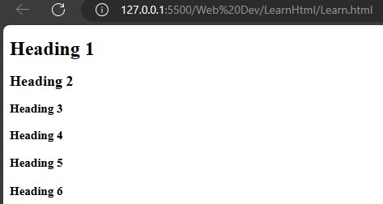

><br>💡<br> 
Default sizes for headings:<br>
Heading level 1: 24 pixels<br>
Heading level 2: 20 pixels<br>
Heading level 3: 16 pixels<br>
Heading level 4: 14 pixels<br>
Heading level 5: 12 pixels<br>
Heading level 6: 10 pixels<br><br>

### Paragraph
---
**HTML** has a specific tag to write paragraph `<p>...</p>`
```html
<!DOCTYPE html>
<html lang="en">
<head>
    <meta charset="UTF-8">
    <meta name="viewport" content="width=device-width, initial-scale=1.0">
    <title>Paragraph</title>
</head>
<body>
    <h1>Paragraph</h1>
    <p>Lorem ipsum dolor sit amet consectetur adipisicing elit. Velit tempora adipisci omnis. Dolore molestias et incidunt doloremque quam hic explicabo, quibusdam autem optio nisi! Eveniet, nam sint. Reiciendis, suscipit optio!</p>
    <p>Lorem ipsum dolor sit amet consectetur adipisicing elit. Velit tempora adipisci omnis. Dolore molestias et incidunt doloremque quam hic explicabo, quibusdam autem optio nisi! Eveniet, nam sint. Reiciendis, suscipit optio!</p>
</body>
</html>
```
Output:<br>
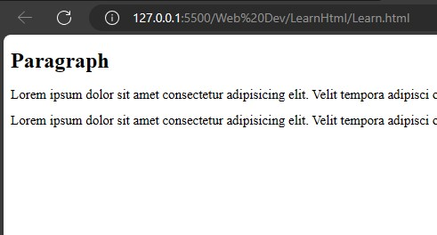
><br>💡<br>
To write demo paragraph use `<p>Lorem ipsum `Tab`</p>`.
<br><br>

### Break tag
---
**HTML** has a special break line tag `<br>`.
```html
<!DOCTYPE html>
<html lang="en">
<head>
    <meta charset="UTF-8">
    <meta name="viewport" content="width=device-width, initial-scale=1.0">
    <title>Paragraph</title>
</head>
<body>
    <h1>Paragraph Without br tag </h1>
    <p>Lorem ipsum dolor sit amet consectetur adipisicing elit. Velit tempora adipisci omnis. Dolore molestias et incidunt doloremque quam hic explicabo, quibusdam autem optio nisi! Eveniet, nam sint. Reiciendis, suscipit optio!
    </p>
    <h1>Paragraph With br tag</h1>
    <p>Lorem ipsum dolor sit amet <br> consectetur adipisicing elit. Velit tempora <br> adipisci omnis. Dolore molestias et incidunt doloremque quam hic explicabo, quibusdam<br> autem optio nisi! Eveniet, nam sint. Reiciendis, suscipit optio!
    </p>
</body>
</html>
```
Output:<br>
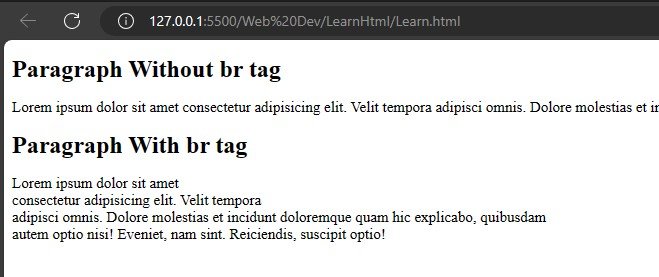

### Pre tag
---
**HTML** has a special tag that helps to print a *ASII* pattern is `<pre> </pre>`.
```html
<!DOCTYPE html>
<html lang="en">
<head>
    <meta charset="UTF-8">
    <meta name="viewport" content="width=device-width, initial-scale=1.0">
    <title>Paragraph</title>
</head>
<body>
    <h2>Without pre tag </h2>
    <p>
        
  _____     ____    _______ 
  |  __ \   / __ \  |__   __|
  | |  | | | |  | |    | |   
  | |  | | | |  | |    | |   
  | |__| | | |__| |    | |   
  |_____/   \____/     |_|   
                             
                             
     
    </p>
    <h2>With pre tag</h2>
    <pre>
        
  _____     ____    _______ 
  |  __ \   / __ \  |__   __|
  | |  | | | |  | |    | |   
  | |  | | | |  | |    | |   
  | |__| | | |__| |    | |   
  |_____/   \____/     |_|   
                             
                             
 
    </pre>
</body>
</html>
```
Output:<br>
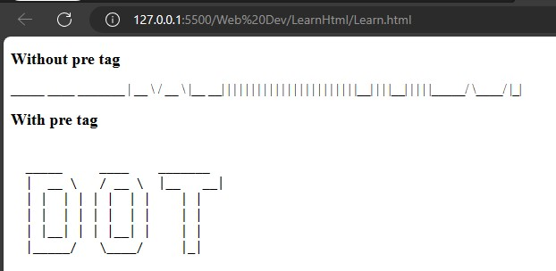

### Comment
---
  The Commented area is not visually shown. It is used to understand code for next developer. it is used if the text is writen between `<--`and`-->`.
  ```html
  <!DOCTYPE html>
  <html lang="en">
  <head>
      <meta charset="UTF-8">
      <meta name="viewport" content="width=device-width, initial-scale=1.0">
      <title>Comment</title>
  </head>
  <body>
      <h1>Comment is not used</h1>
      <!-- <p>Comment is used</p> -->
  </body>
  </html>
  
  ```
  Output:<br>
  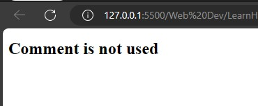
  ><br>💡<br>
  Comments are available to be read in the source view.<br>
  Sortcut key to use comment in or comment out is `CTRL+/`.
  <br><br>
  
### Bold & Strong
---
  To make a text bold, use the `<b>` tag. There is another tag, `<strong>`, that works the same as `<b>`, but the `<strong>` tag is more important for search engines. If the keyword of a search matches the text in the `<strong>` tag, the search engine will give the page more priority.
  
  ```html
   <!DOCTYPE html>
   <html lang="en">
   <head>
       <meta charset="UTF-8">
       <meta name="viewport" content="width=device-width, initial-scale=1.0">
       <title>Bold and strong</title>
   </head>
   <body>
      <p>
       Lorem ipsum, dolor sit amet <b>consectetur</b> adipisicing elit. <br>Vero debitis alias maiores, quasi <strong>inventore</strong>, tenetur quos,  corrupti beatae corporis quibusdam voluptate!<br> Incidunt commodi a nisi repudiandae eos, consequuntur laboriosam.
      </p>
   </body>
   </html>
  ```
  
   Output:<br>
   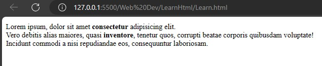

### i & em
---
  To make a text italic, use the `<i>` tag. There is another tag, `<em>`, that works the same as `<i>`, but the `<em>` tag is more important for search engines, `em` means empisize. If the keyword of a search matches the text in the `<em>` tag, the search engine will give the page more priority.
  ```html
  <!DOCTYPE html>
  <html lang="en">
  <head>
      <meta charset="UTF-8">
      <meta name="viewport" content="width=device-width, initial-scale=1.0">
      <title>i and em</title>
  </head>
  <body>
     <p>
      Lorem ipsum, dolor sit amet <i>consectetur</i> adipisicing elit. <em>Vero debitis alias</em> maiores,<br> quasi <em>inventore</em>, tenetur quos,  corrupti beatae corporis quibusdam voluptate!<i> Incidunt commodi a nisi repudiandae eos,<br> consequuntur laboriosam</i>.
     </p>
  </body>
  </html>
  ```
  Output:<br>
  

### Small
---
  The `<small>` tag is used to make text smaller compared to other text styles used in the sentence. It is used to reduce the importance of the text. It is often used for copyright information, legal disclaimers, and other side comments.
  ```html
  <!DOCTYPE html>
  <html lang="en">
  <head>
      <meta charset="UTF-8">
      <meta name="viewport" content="width=device-width, initial-scale=1.0">
      <title>i and em</title>
      <style>
          p{
              font-family: 'Lucida Sans', 'Lucida Sans Regular', 'Lucida Grande', 'Lucida Sans Unicode', Geneva, Verdana, sans-serif;
          }
      </style>
  </head>
  <body>
      <h3>Without small tag</h3>
      <p>Copyright &copy; 2023 Example Company. All rights reserved.</p>
  
      <h3>With samll tag</h3>
      <p><small>Copyright &copy; 2023 Example Company. All rights reserved.</small></p>
  
  </body>
  </html>
  ```
  Output:<br>
  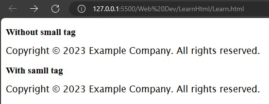
  
### Sub & Sup
  ---
  The **subscript** tag, `<sub>`, is used to write lower baseline text in a smaller size, such as chemical formulas and footnote numbers.<br> The **superscript** tag, `<sup>`, is used to write raised baseline text in a smaller size, such as numerical exponents.
  ```html
  <!DOCTYPE html>
  <html lang="en">
  <head>
      <meta charset="UTF-8">
      <meta name="viewport" content="width=device-width, initial-scale=1.0">
      <title>Sub and sup</title>
      <style>
          p{
              font-family: Verdana, Geneva, Tahoma, sans-serif;
          }
      </style>
  </head>
  <body>
      <h3>Chemical formula of Ethanol: </h3>
      <p>C<sub>2</sub>H<sub>6</sub>O</p>
      <h3>What is log<sub>2</sub>64: </h3>
      <p>2<sup>6</sup>=64. so log<sub>2</sub>64 is 6.</p>
  </body>
  </html>
  ```
  Output:<br>
  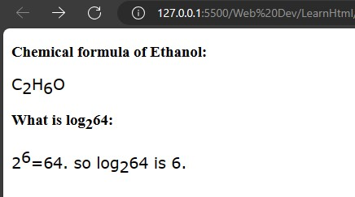
  
### del, ins & mark tag 
---
  The `<del>` tag is used to delete text, but shows it in ~~strick Though~~ to the reader and also to indicate that it has been deleted or to show a new update by highlighting by the use `<ins>` or `<mark>` tag.
  ```html
  <!DOCTYPE html>
  <html lang="en">
  <head>
      <meta charset="UTF-8">
      <meta name="viewport" content="width=device-width, initial-scale=1.0">
      <title>del ins and mark</title>
      <style>
          p{
              font-family: Verdana, Geneva, Tahoma, sans-serif;
          }
      </style>
  </head>
  <body>
      <p>
          In this paragraph, <del>this text has been deleted</del>, <mark>this text was updated recently</mark>, and <ins>it will be update again</ins>.
      </p>
  </body>
  </html>
  ```
  Output:<br>
  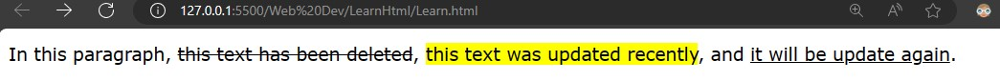

### Blockquote, q, cite & `<cite>`
---
`<blockquote>` is used to write a quote, but it does not give any styling like `<q>` does. In Google SEO, `<blockquote>` is given more priority compared to `<q>.` To make `<blockquote>` look good, we use `CSS`.<br>
To give a reference to a quote, use the `cite` attribute to provide a link or to give the name of the person who wrote the quote using the `<cite>` tag.
```html
<!DOCTYPE html>
<html lang="en">
<head>
    <meta charset="UTF-8">
    <meta name="viewport" content="width=device-width, initial-scale=1.0">
    <title>quote</title>
</head>
<body>
    <p style="background-color: yellowgreen;">Today's quote.</p>
    <blockquote cite="https://www.hs-aalen.de/de">
        Programming isn't about what you know; it's about what you can figure out.
    </blockquote>
    <q style="background-color: rgb(166, 193, 194);">
        Programming isn't about what you know; it's about what you can figure out.
    </q>
    <cite>- Grace Hopper</cite>
</body>
</html>
```
Output:<br>
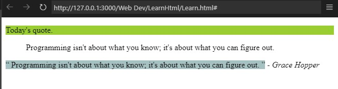

### aabr
---
`<abbr>` tag is used to add `Abbreviation`. To define the `abbr` use `title` attributes.
```html
<!DOCTYPE html>
<html lang="en">
<head>
    <meta charset="UTF-8">
    <meta name="viewport" content="width=device-width, initial-scale=1.0">
    <title>Abbreviation</title>
</head>
<body>
<abbr title="Hyper text markup language">HTML</abbr>
</body>
</html>
```
Output:<br>
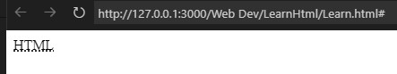
>Note: To see the abbreviation hover the mouse on the HTML part.

### bdo
---
`<dbo>` is Bidirectional Text Override element that helps to change the direction of the text from `dir` attribute `ltr` or `rtl`.
```html
<!DOCTYPE html>
<html lang="en">
<head>
    <meta charset="UTF-8">
    <meta name="viewport" content="width=device-width, initial-scale=1.0">
    <title>Direrectionl text</title>
</head>
<body>
Name:Prince <br>
Name:<bdo dir="req">Prince</bdo><br>
Name:<bdo dir="ltr">Prince</bdo><br>
Name:<bdo dir="rtl">Prince</bdo><br>
</body>
</html>
```
Output:<br>
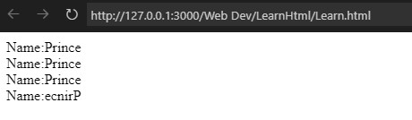

### address
---
`<address>` tag is used to write the address. It will helps to improve the SEO for browser.
```html
<!DOCTYPE html>
<html lang="en">
<head>
    <meta charset="UTF-8">
    <meta name="viewport" content="width=device-width, initial-scale=1.0">
    <title>address</title>
</head>
<body>
<p style="border: 5px solid rgb(137, 106, 167);border-radius: 50px;font-size: 20pt; padding-left: 12px; color: white; background: rgb(69, 40, 97)">Today is no meeating!!</p>
<address style="border: 2px dotted blueviolet;">
    #147,<br>
    New town apartment <br>
    New york,USA
</address>
</body>
</html>
```
Output:<br>
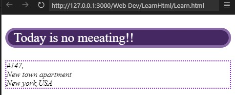

### anchor
---
`<a>` anchor tag is used to make a clickable like for website,tel,email etc.<br>Attributes of anchor tag are:
- download
  - In `download` attribute given file get downloaded in the system.
  ```html
    <!DOCTYPE html>
  <html lang="en">
  <head>
      <meta charset="UTF-8">
      <meta name="viewport" content="width=device-width, initial-scale=1.0">
      <title>Download</title>
  </head>
  <body>
      <p><a href="Images/Download.jpg" download="File Downloaded">Click here</a> to Download file.</p>
  </body>
  </html>
  ```
  Output:<br>
  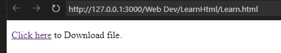
  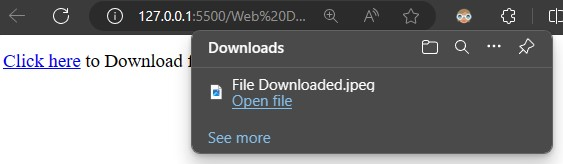
  
  <br>
- href
  - `href` used to provide hyperlink referance to the text that has provided. It could be a link of **absolute URL** ,**relative URL**, **Element on the same page** ,**telephone** ,**email-id** ,**sms**.
    - Absolute URL<br>
      URL's data are not saved to user server known as absolute url.
      ```html
      <!DOCTYPE html>
      <html lang="en">
      <head>
          <meta charset="UTF-8">
          <meta name="viewport" content="width=device-width, initial-scale=1.0">
          <title>Absolute URL</title>
      </head>
      <body>
          <a href="https://google.com">
              <p style="border:none;background:linear-gradient(60deg,#569656,#096109);border-radius: 5px;height: 50px;width: 100px;">              
              </p>
          </a>
      </body>
      </html>
      ```
      Output<br>
      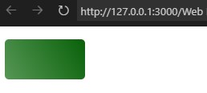
      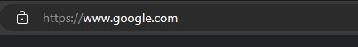
    - Relaive URL<br>
      URL's data are saved to user servet known as relative url.  
        ```html 
        <!DOCTYPE html>
        <html lang="en">
        <head>
            <meta charset="UTF-8">
            <meta name="viewport" content="width=device-width, initial-scale=1.0">
            <title>Relative URL</title>
        </head>
        <body>
            <a href="./Images">
                <p style="border:none;background:linear-gradient(60deg,#569656,#096109);border-radius: 5px;height: 50px;width: 100px;color: white;">
              
                </p>
            </a>
        </body>
        </html>
              </body>
              </html>
        ```
        Output:<br>
      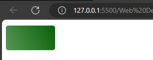
      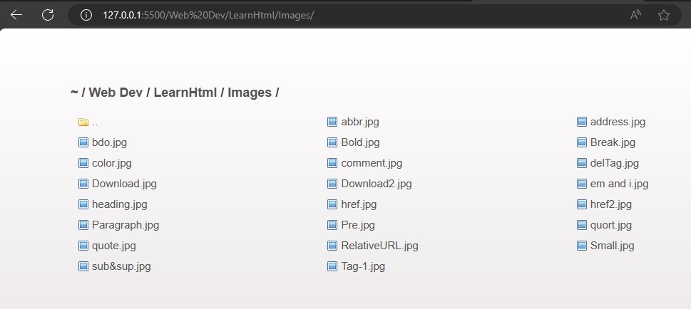
    - Element on the same page<br>
      To link an element on the same page, you need to add an `id` attribute to the element and then use `href="#id_name"` in the `<a>` tag. 
      ```html
      <!DOCTYPE html>
      <html lang="en">
      <head>
          <meta charset="UTF-8">
          <meta name="viewport" content="width=device-width, initial-scale=1.0">
          <title>Relative URL</title>
      </head>
      <body>
       <h2>Table of Content</h2>
       <a href="#Topic1"><h3>Topic 1</h3></a>
       <a href="#Topic2"><h3>Topic 2</h3></a>
       <a href="#Topic3"><h3>Topic 3</h3></a>
       <hr>
       <h2 id="Topic1">Topic 1</h2>
      <p>Text here</p>
       <h2 id="Topic2">Topic 2</h2>
       <p>Text here</p>
       <h2 id="Topic3">Topic 3</h2>
       <p>Text here</p>
      </body>
      </html>
      ```
      Output:<br>
      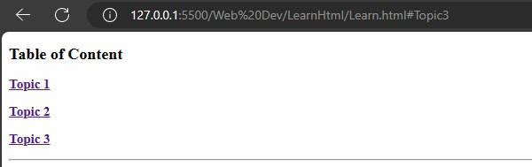
      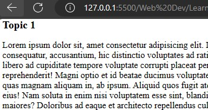
    - tel, mailto, sms<br>
      To diractly open call,mail box and sms box use `tel`, `mailto` and `sms`. In `herf="tel:+91.89.969.1238"`.
       ```html
       <!DOCTYPE html>
       <html lang="en">
       <head>
           <meta charset="UTF-8">
           <meta name="viewport" content="width=device-width, initial-scale=1.0">
           <title>Contact Us</title>
       </head>
       <body>
       <h3>Mail Us:</h3><a href="mailto:pq6211@gmail.com">pq6211@gmil.com</a>
       <h3>Contact Us:</h3><a href="tel:+918695901836">+91 869501836</a>
       <h3>Massage Us:</h3><a href="sms:"><a href="sms:+918695901836?body=Hello from HTML!">SMS Us</a>
       
       </body>
       </html>
       ```
       Output<br>
       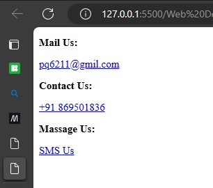

    - hreflang & lang<br>
      The `hreflang` and `lang` attributes both serve to specify the language of the page. They help to improve the page's reach, enhance its SEO, and boost traffic to the page.
      |language|lang code|
      |---|---|
      |English|en|
      |Frence|fr|
      |Spanish|es|
      |German|de|
      |Italian|it|
      |Japanese|ja|
      |Chinese|zh-cn/zh-tw|
      |Russian|ru|
      |Korean|ko|
      |Portuguese(Brazil)|pt-br|
      ```html
      <!DOCTYPE html>
       <html lang="fr">
       <head>
           <meta charset="UTF-8">
           <meta name="viewport" content="width=device-width, initial-scale=1.0">
           <title>Lang</title>
       </head>
       <body>
        <h5>Bonjour, comment allez-vous? </h5>
       </body>
       </html>
      ```
      Output:<br>
      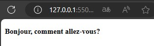      
      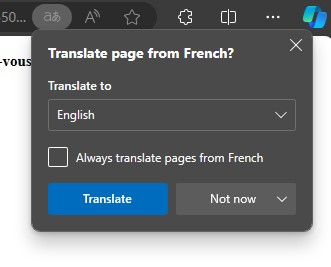
      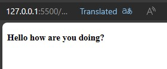
    - Target<br>
    The `target` attribute in HTML is used to specify where to open the linked document.
      - `_blank`: Opens the linked document in a new window or tab.
      - `_self`: Opens the linked document in the same window or tab.
        ```html
        <!DOCTYPE html>
        <html lang="en">
        <head>
            <meta charset="UTF-8">
            <meta name="viewport" content="width=device-width, initial-scale=1.0">
            <title>Target</title>
        </head>
        <body>
            <a href="https://google.com" target="_blank"><h3>_blank Open in new tab</h3></a>
            <a href="https://google.com" target="_self"><h3>_self Open in same tab</h3></a>
        </body>
        </html>
        ```
        Output:<br>
        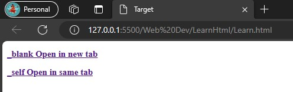    
        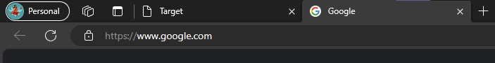
        
        
### HTML Attributes
---
<details>
<summary>Attributes</summary>

- [Color](#color)
- 
</details>

---
### Color
---
Colors are represented in `HEX`, `RGB`, `RGBA`, `HSL` & `CMYK`.
- ### HEX
  `HEX` is a shorthand way of representing RGB colors. It uses a hexadecimal (base 16) number system to represent the red, green, and blue components of a clolor. `HEX` code are typiccally written as a six digit number, with each pair of components. For example, the hex code `#FFFFFF` represents pure white, while the hex code `#000000` represents pure black.
- ### RGB
  `RGB` is a color model that uses the additive primary colors red, green, and blue to represent all colors. Each primary color is represented by a value from `0` to `255`, with `0` being the darkest and 255 being the brightest. By combining the different intensities of the red, green, and blue primary colors, any color can be represented.
- ### RGBA
  `RGBA` is an extension of the RGB color model that adds a fourth channel for transparency. The alpha channel is represented by `A` value from `0` to `255`, with `0` being completely transparent and `255` being completely opaque. `RGBA` colors are often used in web design and graphics to create transparent backgrounds and semi-transparent objects.  
- ### HSL
  `HSL` (Hue, Saturation, and Lightness) is a color model that is based on the way that humans perceive color. It uses three values to represent a color: `hue`, `saturation`, and `lightness`. `Hue` is the fundamental color of the color, `saturation` is the intensity of the color, and `lightness` is the brightness of the color. Range of `hue` value is `0` to `360` as a colour 
- ### CMYK
  `CMYK` (`Cyan`, `Magenta`, `Yellow`, and `Black`) is a color model that is used in printing. It uses four inks to represent all colors: `cyan`, `magenta`, `yellow`, and `black`. By combining the different inks, any color can be represented.

```html
<!DOCTYPE html>
<html lang="en">
<head>
    <meta charset="UTF-8">
    <meta name="viewport" content="width=device-width, initial-scale=1.0">
    <title>del ins and mark</title>
    <style>
        p{
            font-family: Verdana, Geneva, Tahoma, sans-serif;
        }
    </style>
</head>
<body style="background-color: rgb(0, 0, 0);">
    <p style="color:rgb(255, 154, 0);">
        In this paragraph
    </p>
</body>
</html>
```
Output:<br>
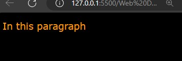

### 

